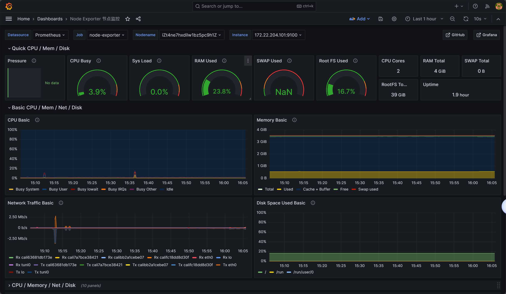
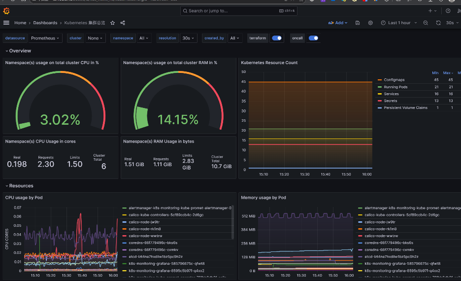
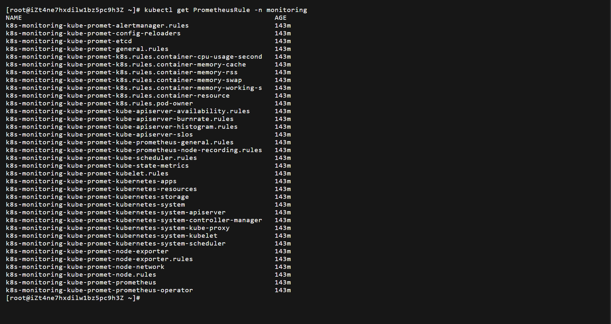
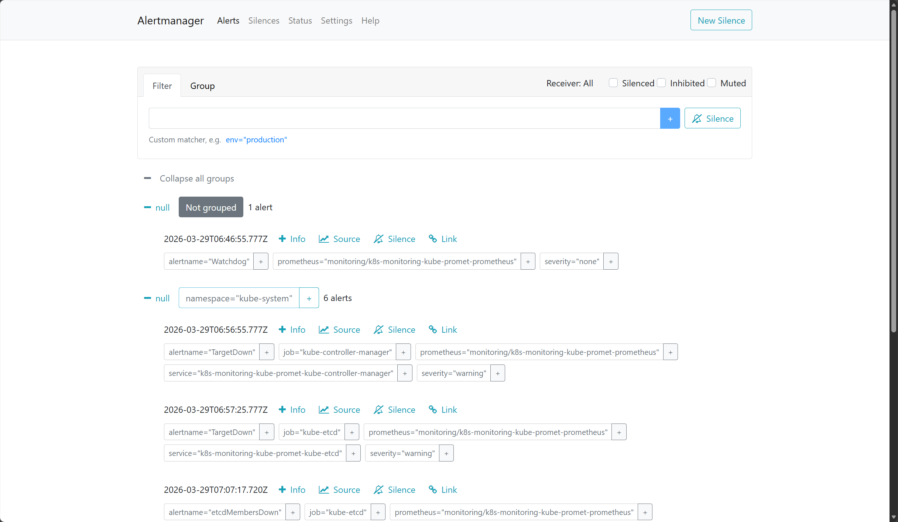
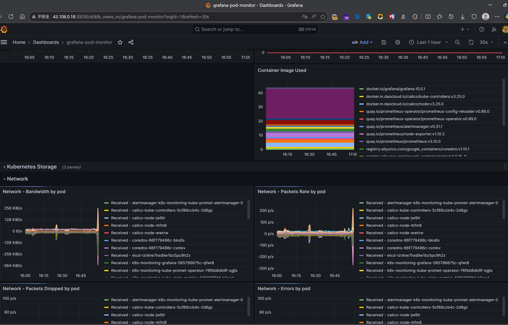
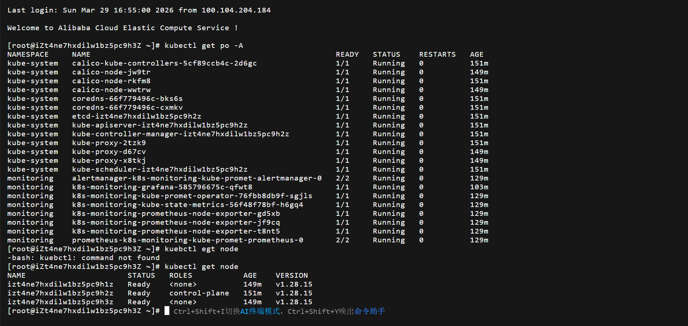
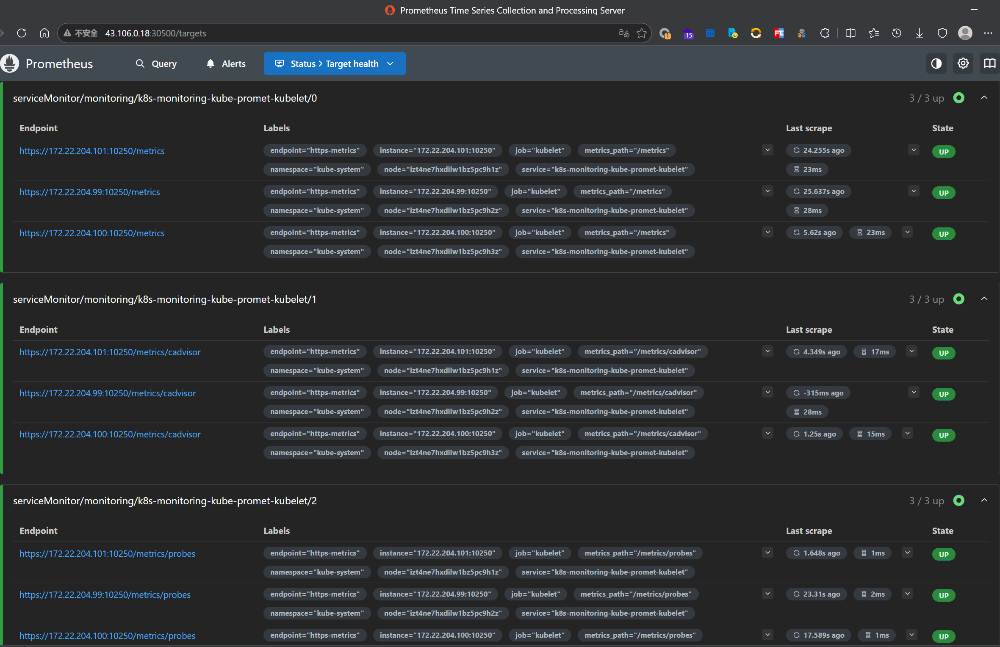
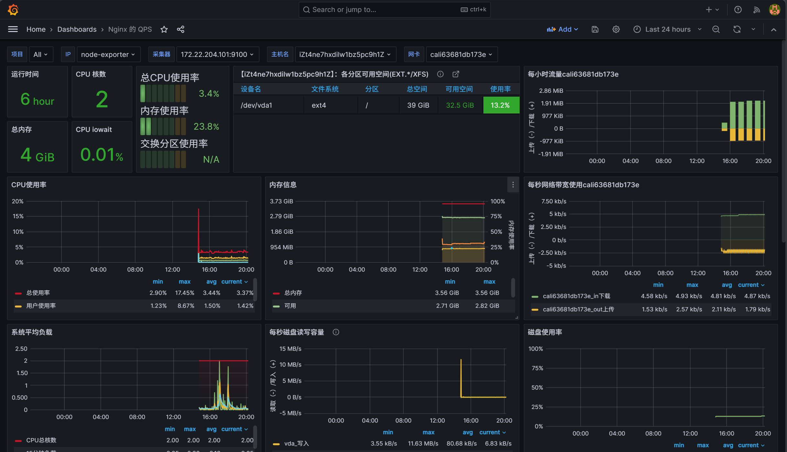
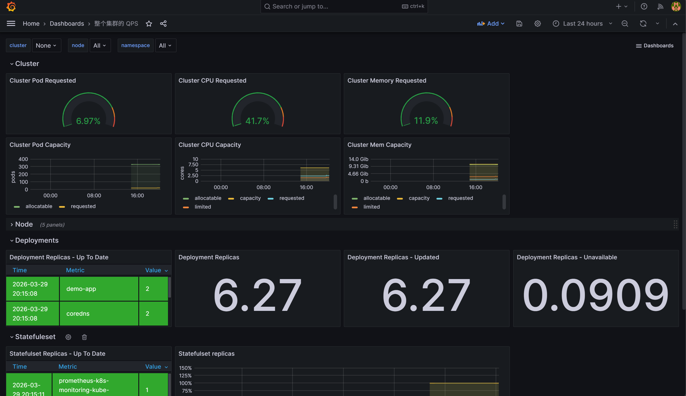

# k8s-monitoring-platform


    
    
    

> 基于 IaC 理念构建的企业级 Kubernetes 监控平台，支持 Prometheus + Grafana + Alertmanager + Exporters 的一体化部署，面向基础设施、集群组件与业务应用的端到端可观测性建设。
> 
> 

## 目录

- [项目简介](https://www.doubao.cn)

- [核心特性](https://www.doubao.cn)

- [技术栈](https://www.doubao.cn)

- [项目结构](https://www.doubao.cn)

- [快速开始](https://www.doubao.cn)

- [监控体系](https://www.doubao.cn)

- [告警分级策略](https://www.doubao.cn)

- [部署成效](https://www.doubao.cn)

- [相关文档](https://www.doubao.cn)

- [截图展示](https://www.doubao.cn)

- [贡献指南](https://www.doubao.cn)

- [开源协议](https://www.doubao.cn)

## 项目简介

`k8s-monitoring-platform` 是一款面向 Kubernetes 云原生场景的开源一站式监控解决方案，聚焦企业级集群可观测性建设，摒弃零散化部署配置，通过声明式API与自动化脚本，实现监控全链路组件的标准化部署、版本化管理与精细化运维。
项目针对云原生监控痛点，整合主流云原生监控组件，将监控规则、可视化大屏、告警策略全部纳入Git版本管控，兼顾部署便捷性与后期可维护性，助力研发与运维团队快速搭建稳定、高效、可扩展的K8s监控体系。项目已在3节点高可用K8s集群落地验证，可稳定支撑20+微服务、峰值QPS 5000+高并发业务监控需求，完整覆盖服务请求量、QPS波动等核心业务指标观测。

## 核心特性

- **IaC 化管理**：监控规则、Dashboard、Helm Values 解耦，纳入 Git 版本管理，可回溯、可复用、可批量迁移

- **自动化部署**：提供 `deploy.sh` 与 `Makefile` 双部署方式，支持一键部署，大幅降低部署门槛

- **分级告警策略**：精细化 P0 / P1 / P2 三级告警，区分故障等级，提升故障响应效率

- **多维度指标采集**：集成 Node Exporter、cAdvisor、kube-state-metrics，全覆盖基础设施、集群、业务三层指标，新增服务QPS、请求量监控，消除监控盲区

- **可视化大屏**：预置标准化 Grafana Dashboard，直观展示集群健康、资源水位、业务运行状态、服务QPS走势，支持可视化面板定制化

- **预测性告警**：基于 `predict_linear`等 PromQL 高级函数，实现磁盘容量、资源使用率、服务QPS提前预警，减少线上故障发生

- **高可用设计**：适配 3 节点高可用 Kubernetes 集群，支撑生产环境稳定运行

- **模块化扩展**：组件解耦设计，支持按需新增监控组件、自定义监控指标与告警规则，横向扩展能力强

## 技术栈

- 容器编排：Kubernetes 1.28+

- 包管理：Helm 3

- 指标采集：Prometheus、node-exporter、kube-state-metrics、cAdvisor

- 可视化：Grafana 10.0+

- 告警管理：Alertmanager

- 查询语言：PromQL

- 自动化脚本：Bash、Makefile

## 项目结构

```bash
├── alerts                  # 告警规则配置文件
├── dashboards              # Grafana 大屏相关资源
├── docs                    # 项目文档（架构、部署、告警、看板说明）
├── examples                # 业务监控示例应用
├── grafana                 # Grafana Dashboard JSON 配置
├── helm                    # Helm 部署自定义配置
├── manifests               # K8s 基础资源清单
├── prometheus              # Prometheus 采集规则、全局配置
├── screenshots             # 项目效果截图
├── scripts                 # 自动化部署、运维脚本
├── LICENSE                 # 开源协议文件
└── README.md               # 项目说明文档
```

## 快速开始

```bash
## 快速开始（完整部署流程）

### 1. 克隆仓库
git clone https://github.com/Adore-hub/k8s-monitoring-platform.git
cd k8s-monitoring-platform

### 2. 前置环境准备
确保集群环境满足以下条件：
- 正常运行的 Kubernetes 集群（1.28+）
- 已安装 Helm 3 工具
- 本地已配置 kubectl 且可正常访问集群

### 3. 创建监控专属命名空间
kubectl apply -f manifests/namespace.yaml

### 4. 一键部署监控平台
# 部署方式一：执行自动化脚本部署
chmod +x scripts/deploy.sh
./scripts/deploy.sh

# 部署方式二：通过 Makefile 部署
make deploy

### 5. 查看组件运行状态
# 查看 Pod 运行状态
kubectl get pods -n monitoring
# 查看服务暴露信息
kubectl get svc -n monitoring
```

## 监控体系

###  基础设施层

- 节点核心指标：CPU使用率、内存占用、磁盘读写、磁盘空间

- 节点健康状态监控

- 容器运行状态、资源占用实时监控

###  集群层

- Pod 异常重启次数监控

- Deployment、Statefulset 副本数一致性校验

- 节点 NotReady 异常告警

- PVC 存储容量、磁盘使用率预警

###  业务层

- 业务应用可用性监控

- HTTP 请求错误率、接口延迟趋势监控

- 业务应用异常资源消耗监控

## 告警分级策略

按照故障影响范围与严重程度，划分三级告警，适配不同运维响应优先级：

- **P0 级（紧急故障）**：核心业务不可用、节点宕机、监控核心组件故障，需立即处理

- **P1 级（重要告警）**：资源使用率逼近阈值、Pod 持续异常重启、服务响应超时，需及时处理

- **P2 级（一般提示）**：资源容量趋势预警、低优先级组件异常，需定期关注跟进

## 部署成效

- 适配 3 节点高可用 Kubernetes 集群，满足生产环境稳定性、高可用要求
- 故障定位效率提升约 50%，缩短故障排查时长，加快业务恢复速度
- 优化告警规则，通过分级策略与高级PromQL函数，告警误报率降低 30%+
- 可稳定承载 20+ 微服务、峰值QPS 5000+高并发场景下的监控接入，精准采集服务QPS、请求速率等核心指标，监控采集无性能瓶颈，数据上报稳定不丢包
- 形成可复用的云原生监控最佳实践，可快速迁移至同类K8s集群环境

## 相关文档

- 架构说明

- 部署手册

- 告警规则配置说明

- Grafana Dashboard 使用指南

## 截图展示

所有截图统一存放至项目 screenshots/ 目录下，以下为项目实际运行效果展示：
1. Prometheus Targets 采集状态
监控采集链路全量健康，节点、集群组件采集目标正常上线，保障监控数据完整采集：



2. Grafana 集群总览监控大屏
集群全局资源水位、组件健康状态、Pod与节点资源分布一站式可视化展示：



3. Grafana 节点资源监控大屏
单节点CPU、内存、磁盘、网络等基础设施指标精细化监控，直观查看节点负载：



4. Grafana Pod/容器监控大屏
Pod与容器级别资源占用、运行状态、重启次数等核心指标监控，定位微服务异常：



5. Alertmanager 活跃告警面板
告警统一收敛、分组管理，清晰展示集群内异常告警信息，支撑故障响应：



6. 告警规则库列表
内置K8s原生告警规则+自定义分级告警规则，全量告警策略可管控、可扩展：



7. 监控组件运行状态
3节点集群下，所有监控组件稳定Running，部署架构高可用：



8. 业务QPS监控大屏
实时展示微服务接口QPS、请求速率、流量波动趋势，直观把控业务并发状态：



10. QPS异常告警面板
针对服务QPS突降、流量异常波动场景触发精准告警，快速定位业务故障：




## 贡献指南

欢迎各位开发者提交 Issue 与 PR，共同完善项目：

1. Fork 本项目至个人仓库

2. 新建功能分支，完成代码开发与优化

3. 提交 Commit 并推送至个人仓库

4. 提交 Pull Request，等待审核合并

## 开源协议

本项目基于 **MIT License** 开源协议，可自由使用、修改与分发，详情查看 [LICENSE](LICENSE) 文件。
